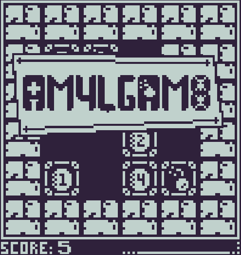
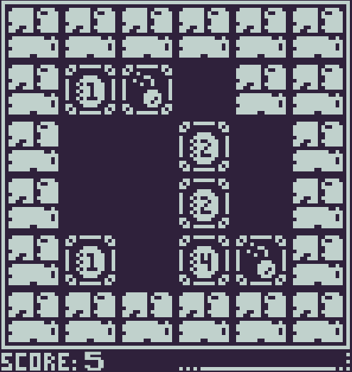
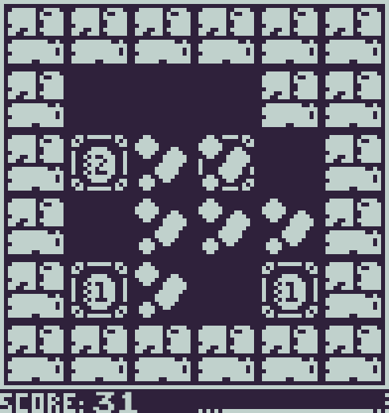

# AM4LGAM8 - Ludum Dare #54

> AMALGAMATE (Intransitive verb) : To combine into a unified or integrated whole

A game made in 48 hours for the [Ludum Dare](ldjam.com) Game Jam using Rust+Bevy. The theme was "Limited Space".

AM4LGAM8 is a simple Puzzle-game, and a tribute to 2048 (hence the numbers in the name). The goal is to score as many points as possible by exploding tiles using bombs. As you have very limited space, you can combine tiles so that they take up less space. Combining bombs together will explode the tiles and add their value to your score. As you progress in your run, walls will start appearing, further reducing your already limited space, until you eventually lose.

The game ends when you have no more possible moves.

The game is playable on the Web here : https://opinon.itch.io/am4lgam8-ludum-dare-54.

# Screenshots

# Tech

I used Rust and Bevy, Aseprite for the graphics.
The codebase is not exactly what I would call "clean code" (it is a game jam, what do you expect ?), and therefore there are bugs, I'm sure.
I've written a few unit tests that have actually proven to be useful.

I have tried to keep the core of the game logic decoupled from Bevy as much as possible (see the `game` module), so that Bevy just acts as a frontend.
For convenience, I ended up having to implement Bevy's traits for `Resource`, `Components` and `Events` anyway, but that's about it for the strictly Bevy-related stuff.

For the plugins used, have a look inside `main.rs`. There are a couple of interesting hacks for pixel-art games in Bevy, as well as a `bevy_mod_picking` backend hacked
together from a Github thread.

The UI is mostly just handplaced sprites to decorate a bit.
